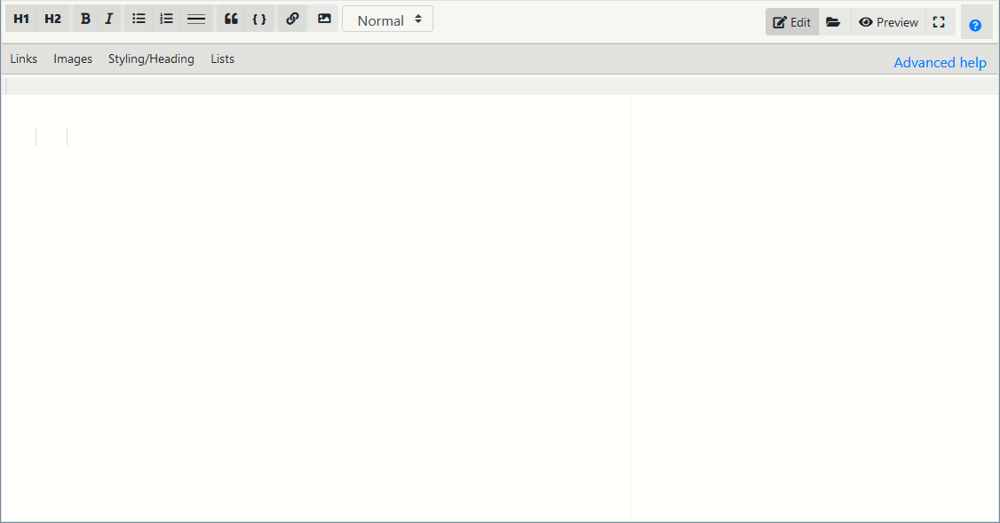
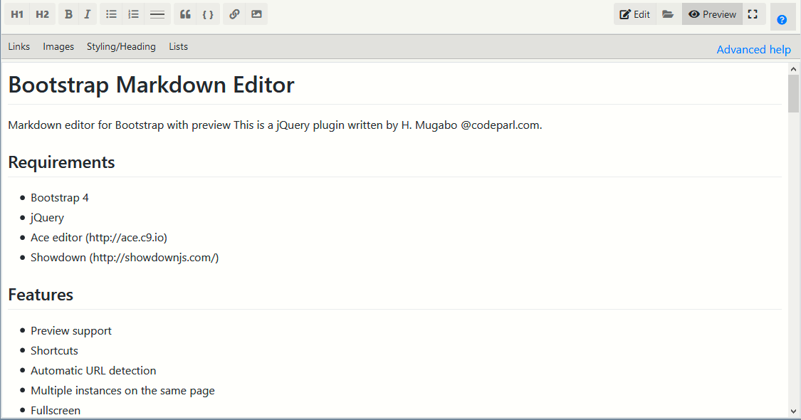

# Bootstrap Markdown Editor


Markdown editor for Bootstrap with preview 
This is a jQuery plugin written by H. Mugabo @codeparl.com.

## Requirements

* Bootstrap 4
* jQuery
* Ace editor (http://ace.c9.io)
* Showdown (http://showdownjs.com/)

## Features

* Preview support
* Image uload support
* Shortcuts
* Automatic URL detection
* Multiple instances on the same page
* Fullscreen
* Themes
* help bar
* i18n

## Screenshots





## Setup Example

Include the required  CSS and js files as follows: 

first include the css files in the  `<head>` element of your page
```html
<head>
<link href="https://cdnjs.cloudflare.com/ajax/libs/font-awesome/5.11.2/css/all.min.css" rel="stylesheet">
<link href="https://stackpath.bootstrapcdn.com/bootstrap/4.5.2/css/bootstrap.min.css" rel="stylesheet">
<link href="codeparl-bootstrap-markdown-editor.min.css" rel="stylesheet">
</head>
```

then include the js files before the closing tag of the `<body>` element of your page

```html
<body>

 <!-- your page content -->

 <div class="container">
     <div class="editor-container">
         <!--This is the element that should be selected for the editor-->
         <div class="mardown-editor"> </div>
    </div>
</div>

<!-- scripts  -->
<script src="https://ajax.googleapis.com/ajax/libs/jquery/1.12.4/jquery.min.js"></script>
<script src="https://cdnjs.cloudflare.com/ajax/libs/popper.js/1.14.0/umd/popper.min.js"></script>
<script src="https://stackpath.bootstrapcdn.com/bootstrap/4.5.2/js/bootstrap.min.js"></script>
<script src="https://cdnjs.cloudflare.com/ajax/libs/ace/1.4.3/ace.js"></script>
<script src="https://cdnjs.cloudflare.com/ajax/libs/showdown/1.9.1/showdown.min.js"></script>
<script src="codeparl-bootstrap-markdown-editor.min.js"></script>
</body>
```


## Example Usage

### Initialize the editor:

```javascript
//select your  div element to turn into a markdown editor.

//with default options 
$('.mardown-editor').codeparlMarkdown();

//override default options 
$('.mardown-editor').codeparlMarkdown({
    fullscreen: false,
        content: {
            allowScript: true,
        },
          onPreview: function(html) {

            //do something with this html    
        },
        onFileBrowse: function($input, aceEditor) {
            // you can access the file object of this input here.
            // And you may also validate the file type  with your backend script
            
        }
});
```

## Plugin documentation

### Options

The following options can be passed as an object at the initialization of the plugin:

```javascript
$('.mardown-editor').codeparlMarkdown({
 fullscreen: true,
content: {
    allowScript: false,
},
help: {
    show: true,
    link: {
        url: "#",
        text: "Advanced help"
    }
},
editor: {
    softTabs: true,
    theme: 'tomorrow',
    editorHeight: '500px',
    editorWidth: '100%',
    fontSize: 16,
    showGutter: false
},
toolbar: {
    bg: '#F7F7F4',
    buttonGroups: [{
            btnHeader1: 'H1',
            btnHeader2: 'H2',
        },
        {
            btnBold: 'fa-bold',
            btnItalic: 'fa-italic',
        },
        {
            btnList: 'fa-list-ul',
            btnOrderedList: 'fa-list-ol',
            btnRule: 'line',
        },
        {
            btnBlock: 'fa-quote-left',
            btnCode: '{ }',

        },
        {
            btnLink: 'fa-link',
            btnImage: 'fa-image',
        },
        {
            btnHelp: 'fa-question-circle',

        },
        {
            btnEdit: 'fa-edit',
            btnbrowse: 'fa-folder-open',
            btnPreview: 'fa-eye',
            btnFullscreen: 'fa-expand',
        },

    ],
},
onFileBrowse: function($input, aceEditor) {
    // you can access the file object 
    //of this input here. you may also validate the file type 
    // with your backend script
    
},
onPreview: function(html, markdown) {

    //do something with this html    
}
});
```


Also, you can override the plugin default options. Example:

```javascript
$.fn.codeparlMarkdown.defaults.editor.editorHeight = '500px';
```

## License

Licensed under MIT (https://github.com/codeparl/CodeParl-bootstrap-markdown-editor/blob/master/LICENSE).
## Authors

[H. Mugabo - aka codeparl](https://github.com/codeparl)